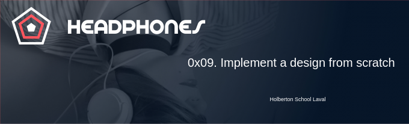
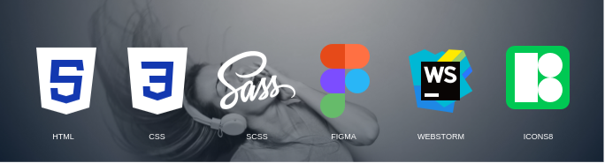

<p align="center">
    
</p>

# The concept

In this project, we will implement from scratch, without any library, a web page. 
We will use all HTML/CSS/Accessibility/Responsive design knowledges that we learned
previously.

We won’t have a lot of instruction, we are free to implement it the way that 
we want - the objective is simple: Have a fully functional web page that looks 
the same as the designer file.

# Tasks

#### 0. Read and be familiar with Figma

Create an account in Figma and open this project and “Duplicate to your Drafts” to have access to all design details.

If you can’t access to it, please find here the Figma file.

__Important notes with Figma:__

* if your computer doesn’t have missing fonts, you can find them here: source-sans-pro and Spin-Cycle-OT
* some values are in float - feel free to round them

For this task, please write an amazing README.md

__Interactions note:__

* the web page must switch to the mobile version when the screen width is 480px or less
* links hover/active: #FF6565
* button hover/active: opacity: 0.9
* max width of the content: 1000px centered in the page

#### 1. Header
Building a web page the right way, is not easy - expect if you put in place strong foundations:

* reset CSS styling
* use variables
* simple/“as generic as you can” CSS selectors
* avoid using super specific CSS selectors as much as possible
* simple HTML structure - div containers are your friend!

Last advice: Personally, I always start to build a web page from outside to inside and from top to bottom. But you can try to other way - it’s fine - but you should structure the way that you will implement a component and not get lost with HTML tags.

Now, your turn!

#### 2. "What we do..." section

Copy files from the previous task.

For this second task: create the “What we do…” section

In this section, you will need custom font icons. Here the archive of it: holberton_school-icon.zip Inside you will find demo page of how to use it.

Important: try to build as generic as you can… you will probably need some components in next section.

#### 3. "Our results" section

Copy files from the previous task.

For this third task: create the “Our results” section

Now you can reuse components form the previous task!

#### 4. Contact us

Copy files from the previous task.

A good landing page has always a contact form.

You are free to add any animations and/or constraints on fields.

### 5. Footer

Copy files from the previous task.

Last piece of the page… the Footer!

And you are done!

Good job!

# Tasks advanced 

#### 6. Replace background image with... code!

In the section “Our results”; without the use of an image file, draw each pentagon using HTML and CSS.

#### 7. Let's animate items

From 4-index.html and 4-styles.css, add fun animations to “What we do…” and “Our results” sections items row. Either all the time, either when hover.

Scaling, opacity, rotation, bouncing… many options!

#### 8. And SASS??

Take your 101-styles.css file and create a 102-styles.scss that will be the SASS version of it.
```text
$ sass 102-styles.scss > 101-styles.css
```

# Desktop result

<p align="center">
    
</p>

# Tablet result

<p align="center">
    
</p>

# Modile result

<p align="center">
    
</p>

# Tools 
<p align="center">
    
</p>

Icons by <a target="_blank" href="https://icons8.com">Icons8</a>

# Contact me
<p align="center">
    <a href="https://www.linkedin.com/in/elodieriou-dev/"></a>
</p>
