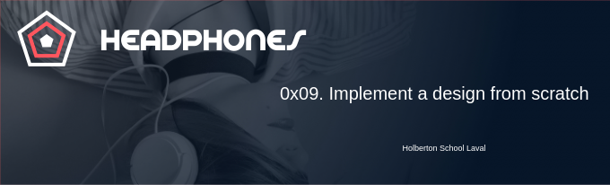

    

# The concept

In this project, we will implement from scratch, without any library, a web page. 
We will use all HTML/CSS/Accessibility/Responsive design knowledges that we learned
previously.

We won’t have a lot of instruction, we are free to implement it the way that 
we want - the objective is simple: Have a fully functional web page that looks 
the same as the designer file.

# Desktop result

    

# Tablet result

    

# Modile result

    

